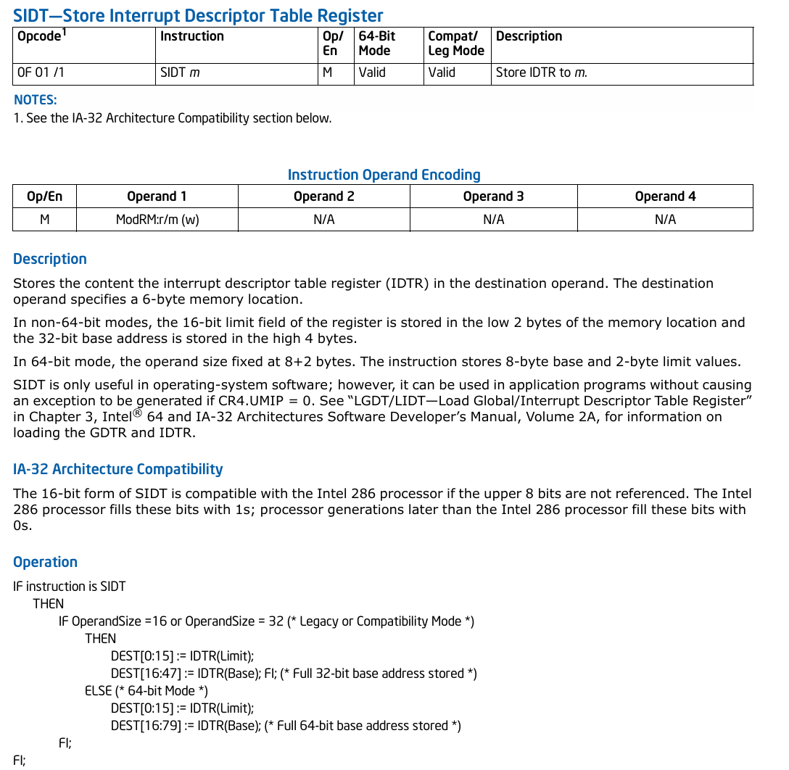

# 恶意软件(Malware)

## 类型

- 后门(backdoor)

  将自己嵌入到计算机中以使远程攻击者喝少或无权在任何相应的本地计算机上执行命令

- 僵尸网络(botnet)

  允许攻击者访问网络, 然而不是从一个远程攻击者那里接收命令, 而是从命令和控制服务器(command-and-control server)那里接收指令, 可以同时操控无限量的计算机

- 下载器(downloader)

  不是恶意代码, 但他的唯一目的是安装其他恶意软件, 下载的其他软件控制系统

- rootkit

  隐藏自身的存在和用户的其他恶意软件, 使得它很难被发现, rootkit可以操纵将自己的IP隐藏在一个IP scan, 这样用户就不会知道他们对僵尸网络或者其他远程计算机有着直接的socket

# X86

## 介绍

x86是基于Intel 8086处理器的**小端**体系结构, 一般来说, 可以在两种操作模式下运行: **实模式和保护模式**:

- 实模式:处理器刚刚上电后只支持16位指令集的状态
- 保护模式: 处理器支持虚拟内存, 分页以及其他功能, 也是运行当前OS的状态

此体系结构的64位拓展称为x64或x86-64


x86通过**环级别**(ring level)的抽象来支持特权隔离, 其中处理器支持4中特权级别, 编号从0到3


RING的设计是将系统权限与进程分离, 使之能够让OS更好的管理当前的系统资源, 使系统更加稳定

## 寄存器

### 通用寄存器

运行于保护模式下的x86有8个32位**通用寄存器**(General Purpose Register, GPR), 指令指针存储在EIP中, 其他的GPR用途:

| 寄存器 | 用途                   |
| ------ | ---------------------- |
| ECX    | 循环计数               |
| EDX    | 存放整数除法产生的余数 |
| ESI    | 字符串/内存操作的源    |
| EDI    | 字符串/内存操作的目的  |
| EBP    | 帧寄存器               |
| ESP    | 栈指针                 |


### 特定模型寄存器

Model-Specific Register, MSR. 每个MSR用名字和一个32位数字标识, 通过RDMSR/WRMSR指令读写, 并且只有RING0级别的代码才能访问此类寄存器, 作用是存储特殊的技术或者实现底层功能(如SYSENTRY指令会将执行跳转到IA32_SYSENTRY_EIP MSR(0X176)存储的地址, 即OS的系统调用处理函数

## 指令集

数据移动的5种方式:

- 立即数$$\rightarrow$$寄存器
- 寄存器$$\rightarrow$$寄存器
- 立即数$$\rightarrow$$内存
- 内存$$\rightarrow$$寄存器(或反向)
- 内存$$\rightarrow$$内存

其中**内存$$\rightarrow$$内存**是x86独有, ARM只支持通过加载/存储指令从内存读写, 而x86可以直接访问内存; 并且x86使用变长指令(1-15Bytes), 而ARM的指令只能是2B或4B

## 语法

x86的汇编代码有两种记法: Intel和AT&T, 语法不同, 语义相同, 区别如下:

- AT&T在寄存器名前加前缀`%`, 立即数加前缀`$`, 16进制前加`0x`, 而Intel不加前缀
- AT&T加入了指示指令宽度的**后缀**(如`movl`(长整形), `movb`(字节)等)
- AT&T把源操作数放在目标操作数之前, 而Intel则相反

具体差别例子如下:

`Intel`:

```assembly
mov ecx, AABBCCDDh
mov ecx, [eax]
mov ecx, eax
```

`AT&T`:

```assembly
movl $0xAABBCCDD, %ecx
movl (%eax), %ecx
movl %eax, %ecx
```

### lea与mov的区别

- `mov`: (**数据传送指令**)

  在寄存器或内存之间传送数据, 将源操作数的值**复制**到目标操作数, 不会改变源操作数的值

- `lea`: (**加载有效地址**)

  `lea`会计算一个由一个或者多个寄存器或内存地址组成的复杂表达式的结果, 并将结果(有效地址)存储到目标寄存器中, 而**不会去访问或修改该地址处的内存内容**

源代码:

```c
#include <stdio.h>

int var_ele(long n, int A[n][n], long i, long j)
{
    return 1;
}

int main()
{
    int A[][3] = {{1,2,3}, {1,2,3}, {1,2,3}};
    var_ele(3, A, 10, 10);
    return 0;
}
```

IDA反汇编结果:

```assembly
; Attributes: bp-based frame

; int __fastcall main(int argc, const char **argv, const char **envp)
public main
main proc near

var_30= dword ptr -30h
var_2C= dword ptr -2Ch
var_28= dword ptr -28h
var_24= dword ptr -24h
var_20= dword ptr -20h
var_1C= dword ptr -1Ch
var_18= dword ptr -18h
var_14= dword ptr -14h
var_10= dword ptr -10h

push    rbp
mov     rbp, rsp
sub     rsp, 50h
call    __main
mov     [rbp+var_30], 1
mov     [rbp+var_2C], 2
mov     [rbp+var_28], 3
mov     [rbp+var_24], 1
mov     [rbp+var_20], 2
mov     [rbp+var_1C], 3
mov     [rbp+var_18], 1
mov     [rbp+var_14], 2
mov     [rbp+var_10], 3
lea     rax, [rbp+var_30]
mov     r9d, 0Ah
mov     r8d, 0Ah
mov     rdx, rax
mov     ecx, 3
call    var_ele
mov     eax, 0
add     rsp, 50h
pop     rbp
retn
main endp
```

### SCAS和STOS

指令的粒度可以是1,2,4字节, `SCAS`隐式的把AL/AX/EAX的数值与地址为EDI的内存数值比较, 并根据EFFLAG中的`DF`标志位(方向标志位, 如果DF=0, 存储器地址自动增加, 串操作指令为自动增量指令)不同, EDI自动递增或递减, 常用于与`REP`前缀一起在一段缓存中寻找某字节,字或双字(`strlen()`). `STOS`是把AL/AX/EAX中的值写入EDI指向的内存中, 常用于把缓存初始化为常量值(如`memset()`)

### 算数运算

其中移动指令通常用于**运算强度简化**

- 乘法运算寄存器使用:

  | **被乘数** | **乘数**  | **乘积** |
  | ---------- | --------- | -------- |
  | AL         | reg/mem8  | AX       |
  | AX         | reg/mem16 | DX:AX    |
  | EAX        | reg/mem32 | EDX:EAX  |

- 除法运算寄存器使用:

    | **被除数** | **除数**  | **商** | **余数** |
    | ---------- | --------- | ------ | -------- |
    | AX         | reg/mem8  | AL     | AH       |
    | DX:AX      | reg/mem16 | AX     | DX       |
    | EDX:EAX    | reg/mem32 | EAX    | EDX      |

- UMUL(有符号除法)的三种形式:

  - `IMUL reg/mem`: 与MUL相同
  - `IMUL reg1, reg2/mem` : reg1 = reg1 * reg2/mem
  - `IMUL reg1, reg2/mem, imm`: reg1 = reg2 * imm

### 栈操作

OS从RING3切换到RING0时, 要把状态信息保存在栈上. x86的栈是ESP指向的一段连续的内存区域, 向下增长. PUSH会递减ESP, 然后把数据写入ESP指向的位置; POP会读出ESP指向的位置的数据并递增ESP(默认递增/减的大小为4, 因为OS要求栈双字对其)

CALL指令:

- 把返回地址压栈(紧接着CALL指令的下一个地址)压栈
- 修改EIP为调用目标地址, 这样就把控制权转给了调用目标, 然后从调用目标继续进行

ERT指令: 把存储在栈的地址出栈道EIP, 然后传递控制给它

#### 调用惯例

Calling Convention, 是编译器在函数调用时遵循的规则, 用于定义函数参数的传递方式, 返回值的处理方式, 寄存器的使用和栈的管理 . 对于特定的系统是由程序二进制接口(ABI)定义的

常见的调用惯例:


其中FASTCALL是Microsoft 编译器支持的一种调用惯例, 规则详细如下:

- **前两个参数通过寄存器传递**：
  - 第一个参数通过 `ecx`（32 位）或 `rcx`（64 位）传递。
  - 第二个参数通过 `edx`（32 位）或 `rdx`（64 位）传递。
- **其余参数通过栈传递**。
- **返回值通过 `eax`（32 位）或 `rax`（64 位）返回**。
- **调用者负责清理栈**。

下面具体分析一个简单的代码:

```c
#include <stdio.h>

int 
__cdecl addme(short a, short b)
{
    return a+b;
}

int main()
{
    short x = 4;
    short y = 5;
    short sum = addme(x, y);
    return 0;
}
```

反编译结果如下:

main:

```assembly
; Attributes: bp-based frame

; int __fastcall main(int argc, const char **argv, const char **envp)
public main
main proc near

var_6= word ptr -6
var_4= word ptr -4
var_2= word ptr -2

push    rbp							; 保存调用者的栈帧基址
mov     rbp, rsp					; 设置当前函数的栈帧基址
sub     rsp, 30h					; 为局部变量分配栈空间（48 字节）
call    __main
mov     [rbp+var_2], 4				; 初始化两个局部变量
mov     [rbp+var_4], 5
movsx   edx, [rbp+var_4]			; 将 var_4 的值（5）符号扩展并加载到 edx 中
movsx   eax, [rbp+var_2]
mov     ecx, eax
call    addme						; 调用 addme 函数，参数通过 ecx 和 edx 传递
mov     [rbp+var_6], ax				; 保存返回值
mov     eax, 0
add     rsp, 30h					; 释放调用者栈帧基址
pop     rbp							; 恢复调用者的栈帧基址
retn
main endp
```

- 可以看出第二行的注释就说明了使用`__fastcall`调用惯例
- `__main`: 是 GCC 编译器在 `main` 函数开始时插入的初始化函数，用于初始化 C 运行时环境
- 根据 `__fastcall` 调用惯例：第一个参数通过 ecx 传递。第二个参数通过 edx 传递。

addme:

```assembly
; Attributes: bp-based frame

public addme
addme proc near

arg_0= word ptr  10h
arg_8= word ptr  18h

push    rbp
mov     rbp, rsp
mov     eax, edx			; 从在main函数传入的两个参数所存储的寄存器中取参数
mov     edx, ecx
mov     [rbp+arg_0], dx
mov     [rbp+arg_8], ax
movsx   edx, [rbp+arg_0]
movsx   eax, [rbp+arg_8]
add     eax, edx
pop     rbp
retn
addme endp
```

### 控制流

常见标志位:

- ZF: 结果是否为0
- SF: 符号标志, 设为当前结果的最高有效位
- CF: 借位标志, 当前结果是否需要借位, 对**无符号整数**才有效
- OF: 溢出标志, 当前结果是否超过了最大值, 对**有符号整数**有效


if-else的反汇编程序:

```c
#include <stdio.h>

int main()
{
    int* esi = NULL;

    if(*esi == 0){
        return 1;
    }
    return 0;
}
```

反汇编结果:


其中jnz为跳转指令

- 注: IDA切换流程图和反汇编代码快捷键为空格

## 系统机制

### 地址转换

物理内存以4KB为一个page, 在分页机制启动的情况下, 处理器执行的指令中使用的地址是虚拟地址, 而物理地址是处理器访问内存时使用的 实际内存地址, MMU(内存管理单元)在访问内存之前先透明的将虚拟地址转化为物理地址. 

虚拟地址看似是一个16进制数, 实际上对于MMU是**结构化**的, 对于支持PAE(物理地址拓展)的x86系统上虚拟地址划分为:(也即分页机制的多级页表, 在64位模式下（x86-64），分页机制通常使用 **4 级页表**, 第一级为PML4)

- PDPT(页目录指针表): 用于存储指向页目录（PD）的指针
- PD(页目录): 存储指向页表（PT）的指针
- PT(页表): 存储指向物理页的指针
- PTE(页表项): 是页表中的条目，用于存储物理页的基地址和相关的控制信息, 包含的字段如下:
  - 物理页基地址: 指向物理内存中的页
  - 标志位:
    - **P（Present）**：页是否在内存中。
    - **R/W（Read/Write）**：页是否可写。
    - **U/S（User/Supervisor）**：页是否可被用户程序访问。
    - **A（Accessed）**：页是否被访问过。
    - **D（Dirty）**：页是否被修改过

直接上图(32bit):


- ps: (64位)

  | 63-48 | 47-39 | 38-30 | 29-21 | 20-12 | 11-0   |
  | ----- | ----- | ----- | ----- | ----- | ------ |
  | Sign  | PML4  | PDPT  | PD    | PT    | Offset |

### 中断与异常

OS通过中断与异常实现系统调用

#### 中断

处理器通过数据总线(如PCIE, FireWire, USB)与外部设备连接, 当设备需要处理器处理时, 就会触发一个中断迫使处理器暂停当前的工作, 然后去处理这个设备的请求. 每个中断都关联一个(用于索引到一个**函数指针数组**的)数字, 当处理器收到中断时, 就会执行这个中断关联的数字索引到的函数, 然后恢复执行中断前的工作, 一般由硬件设备触发(即硬件中断, 是异步的过程)

#### 异常

两大类:

- 错误(fault):

  *可修正的异常*, 如缺页(处理器访问了地址有效, 但是当前的页已经被换出而导致数据不再主存), 这时处理器就会调用缺页异常处理程序来修正此错误, 然后**再执行**这条指令(这时就不会发生缺页异常了) 

- 陷阱(trap):

  执行某些特定类型的指令所产生的异常, 如SYSENTRY指令会使得处理器开始执行通用系统调用处理函数, 执行完毕后紧接着它的**下一条指令继续执行**

主要区别就是**运行从哪里恢复**

### 综合练习

#### 阅读汇编程序

阅读下面的汇编:

```assembly
sidt fword ptr [ebp-8]
mov eax, [ebp-6]
cmp eax, 80047400h
```


根据[Intel手册](https://software.intel.com/content/www/us/en/develop/download/intel-64-and-ia-32-architectures-software-developers-manual-volume-2b-instruction-set-reference-m-u.html)中对SIDT的描述:



- 可以知道: SIDT写入IDT寄存器(Store Interrupt Descriptor Table Register, 包含256个中断向量, 每个表项为8B, 包含一个纸箱中断处理程序的指针, 一个段选择符和偏移量)一个6字节的内存区域, 高4B包含了IDT的基地址, 低2B存储表限制(非64bit, 64是8+2), 当中断/异常发生时, 处理器通过中断号索引到IDT, 调用表项中的处理程序, 直观的图如下:

  

- 综上所述: 第二行是读出IDT的基地址

- 第三行的与特殊常数比较, 上网找是win xp的IDT基地址(我没找到)

#### x86实现函数

- `strlen()`:

  ```assembly
  strlen:
  	push ebp			; 保存基址指针
  	mov ebp, esp		; 设置新的基址指针
      push esi			; 保存ESI寄存器
      mov esi, [ebp+8]	; 获取字符串地址(第一个参数)
      xor eax, eax		; 将eax清零, 存储字符串长度
      
  strlen_loop:
  	mov cl, [esi]		; 将ESI指向的字符加载到CL寄存器
  	test cl, cl			; 查看字符串是否结束
  	jz strlen_done		
  	inc eax				; 计数器+1
  	inc esi				; 移动下一个字符
  	jmp strlen_loop
  	
  strlen_done:
  	pop esi
  	pop ebp
  	ret					; 返回, 其中EAX中存储字符串长度
  ```


### x64

x64寄存器组有18个64位GPR(通用寄存器), 前缀为R为64位寄存器

#### rip相对寻址

允许指令引用数据时使用相对于RIP(Instruction Pointer Register, 存储下一条将要执行的指令的内存地址, 在32位称为EIP)的地址, 如`lea rax, [rip+offset]`, 可以方便的访问当前指令附近的变量或者数据, 而不需要显示的计算绝对地址

#### 规范地址

当前的Intel处理器只使用48位地址空间, 所以剩下的16位高有效位都是0或1, 此时称为**规范地址**, 如果代码试图解引用一个非规范地址, 就会触发系统异常


## ARM

arm(Advanced RISC Machine)是RISC体系结构, 与x86相比, **指令集很小**, 但是提供的**通用寄存器很多**, 并且**指令宽度固定**(16/32bits), 内存访问模式是**加载-存储模式**, 就需要操作数据时需要先把他从内存加载到寄存器中, 递增, 然后再存储(即使用了3条指令: 加载, 递增, 存储), 所以逆向工程中代码量更大

在arm中, 有8种不同级别的特权模式:

- **用户模式（User Mode, USR）**：
  - 用于运行应用程序。
  - 权限最低，无法直接访问硬件或执行特权指令。
- **快速中断模式（FIQ Mode, FIQ）**：
  - 用于处理高速中断（Fast Interrupt Request）。
  - 有独立的寄存器组（R8-R14），以减少中断处理时的上下文切换开销。
- **普通中断模式（IRQ Mode, IRQ）**：
  - 用于处理普通中断（Interrupt Request）。
  - 与 FIQ 模式相比，IRQ 模式的优先级较低。
- **管理模式（Supervisor Mode, SVC）**：
  - 用于运行操作系统内核。
  - 当处理器复位或执行 `SWI`（软件中断）指令时，会进入此模式。
- **中止模式（Abort Mode, ABT）**：
  - 用于处理内存访问异常（如访问无效内存地址）。
  - 在数据或指令预取失败时进入此模式。
- **未定义模式（Undefined Mode, UND）**：
  - 用于处理未定义指令异常。
  - 当处理器遇到未定义的指令时，会进入此模式。
- **系统模式（System Mode, SYS）**：
  - 一种特殊的特权模式，与用户模式共享寄存器。
  - 用于运行操作系统的特权任务。
- **监控模式（Monitor Mode, MON）**：
  - 用于安全扩展（TrustZone 技术）。
  - 在安全世界和非安全世界之间切换时使用。

USR模式下运行的代码不同修改系统寄存器, 若要修改通常需要在SVC模式下才能修改, 多数的OS内核模式会运行于SVC, 用户模式运行于USR

### arm特性

#### 运行状态

在x86上可以交替运行在32位和64位模式, 在ARM中的两种状态为: **ARM和Thumb**模式, 两者*只决定指令集而不是特权模式*, ARM为32位宽, 而Thumb通常为16位, 两者执行的因素为:

- 通过BX和BLX指令进行分支跳转是, 如果目标寄存器的最低有效位为1, 切换到Thumb模式
- 当前程序状态寄存器(CPSR)中的T标志位被置起, 处在Thumb模式

默认核心进入arm状态并保持, 直到隐式或显式切换, 较新的OS使用Thumb代码是为了**获得更高的代码密度**


thumb-1与thumb-2的区别:

- **Thumb-1**：16 位指令集，功能简单，代码密度高。
- **Thumb-2**：16/32 位混合指令集，功能强大，性能接近 ARM，代码密度高。


#### 条件执行

arm还支持**条件执行**, 指令中编码了算数条件, 只有在条件满足的时候指令才会被执行, 而x86则是每条指令无条件执行. 条件执行减少了分支指令, 也减少了被执行指令的数目

#### 桶式移位器

可以把多条指令压缩为1条, 即算数指令可以**嵌入到**某些指令中, 如执行:`R1 = R0 * 2`可以这样表示:`MOV R1, R0, LSL #1`(把乘法也放在MOV中)

### 寄存器

定义了16个32位通用寄存器, R0~R15, 通常只使用前13个作为通用寄存器, 最后三个特殊的:

- R13: 栈指针(SP), 等价于X86的ESP/RSP
- R14: 连接寄存器(LR), 保存函数调用的返回地址, 如BL总是在分支跳转到目标地址之前把返回地址保存在LR中, 而x86是将返回地址保存在栈上, 故无响应的寄存器
- R15: 程序计数器(PC), 在ARM状态下执行时当前指令地址增8, 而在Thumb将当前指令地址加4,  类似于X86的EIP/RIP(总是指向下一条执行指令的地址)

ARM把当前执行的转台信息保存在当前程序状态寄存器中(CPSR, 别名APSR), 类似于x86的EFLAGS/RFLAG

### 协处理器

支持额外的指令和系统级设置, arm共有16个协处理器, 即CP0~CP15, 前13个是可选的或是保留的,  CP10, CO11常用于提供浮点数,向量和NEON支持(提供了单指令多数据指令集(SIMD), 常用于多媒体应用程序); CP14,CP15用于调试和系统设置, CP15称为**系统控制协处理器**, 保留系统设置, 管理内存、缓存、MMU（内存管理单元）等系统级功能

举个指令例子:`MRC p15, 0, R0, c1, c0, 0` 表示将 CP15 的寄存器 C1 的值移动到 ARM 寄存器 R0。

- `MRC`（Move to ARM Register from Coprocessor）

### 指令集

ARM的一些指令可以操作一系列寄存器, 如`STM R1, {R6-R10}`可以将5个寄存器保存到R1指向的内存位置, 对于不连续的寄存器也可以使用`,`分隔. 更新基址寄存器的操作在寄存器名后添加`!`, 如`STM R1!, {R6-R10}`,此时R1会被更新为R10的地址的下一个地址


### 数据加载和存储

ARM中加载和存储包括:`LDR/STR, LDM/STM, PUSH/POP`

#### LDR/STR

示例:

```assembly
LDR R3, [R0]	; R3 = *R0
STR R3, [R4]	; *R4 = R3
```

从内存加载和保存到内存1,2,4字节的数据, 具体的格式如下:

- 接收基址寄存器和偏移量:

  - `STR Ra, [Rb, imm]`(立即数作为偏移量)

  - `STR Ra, [Rb, Rc]`(寄存器作为偏移量)

  - `LDR Ra, [Rb, Rc, <shifter>]`(使用标量寄存器作为偏移量, 常用于在数组上的迭代循环, **桶式移位器**用于计算偏移量的步长), 其中Rb是基址寄存器, Rc为一个立即数, <shifter>是在立即数上执行的操作, 通过移动操作对立即数进行等比例放大或缩小

  使用此方法**不会更改**基址寄存器, 下面的两种方法通常用在*多次访问同一个缓冲区中某个偏移量的情况*, 这样编译器可以更新基址寄存器, 节省一条递增指令

- 前索引寻址:

  基址寄存器的值会更新为操作引用的最后的内存地址(与c中的前缀++/--类似)

  `LDR Rd, [Rn, offset]!`

  如: 

  ```assembly
  LDRSB.W R3, [R2, #-1]	; R3 = *(R2-1)
  						; R2 = R2-1
  ```

- 后索引寻址:

  基址寄存器的值用作最后的地址(与c中的后缀自增减类似)

  `LDR Rd, [Rn], offset`

#### LDM/STM

通常用于从内存读出或写入多个**数据块**, 前者是为给定的基址寄存器中加载多个字

`LDM<mode> Rn[!], {Rm}`

- Rn: 基址寄存器
- !: 可选, 基址寄存器是否会更新为新的地址
- Rm: 加载或存储的范围
- mode: 一共四种模式
  - **IA（Increment After）**(默认方式)
    - **LDMIA**: 加载后地址递增。
    - **STMIA**: 存储后地址递增。
    - 操作后基址寄存器指向最后一个操作地址的下一个位置。
  - **IB（Increment Before）**
    - **LDMIB**: 加载前地址递增。
    - **STMIB**: 存储前地址递增。
    - 操作前基址寄存器递增，指向下一个地址。
  - **DA（Decrement After）**
    - **LDMDA**: 加载后地址递减。
    - **STMDA**: 存储后地址递减。
    - 操作后基址寄存器指向最后一个操作地址的前一个位置。
  - **DB（Decrement Before）**
    - **LDMDB**: 加载前地址递减。
    - **STMDB**: 存储前地址递减。
    - 操作前基址寄存器递减，指向下一个地址。


#### PUSH/POP

与LDM/STM类似, 但是他们**隐式的使用SP作为基地址**, SP也会自动更新; 与x86类似, 栈的增长是朝下向低地址方向增长, 语法:

`PUSH/POP {Rn}`

常用到的是在函数的起始和阶,数, 用作函数序言和尾声(保存/恢复寄存器和返回地址), 这也是某些反汇编器使用此模式确定函数的边界

### 函数及其调用

根据目标地址的编码方式, ARM提供了多条指令, 这点与x86只有一个CALL和JMP不同, 其他的不同:

- ARM的返回地址可以保存在栈上, 也可以保存在**链接寄存器**(LR)中, 即调用结束返回时如果不是显式的把返回地址弹出到PC, 就会无条件跳转到LR; 

- 根据目标地址的最低位(LSB)不同, 一次分支跳转可以在AMR/Thumb状态间切换; 

- ARM的标准调用惯例: 前4个32b参数通过R0~R3传递, 其余的参数放在栈上, 返回值保存在R0中

- 调用指令: B, BX, BL, BLX

  - `B imm` : imm是相对于当前指令的偏移量(因为不能使用寄存器), 并且因为两种模式的指令是2/4B对其的, 所以目标偏移量必须是一个偶数

  - BX: (Branch and Exchange)与B不同: BX可以在两种模式间**切换**(exchange, 即如果最低位为1则处理器切换到Thumb), 而且目标地址保存在寄存器中

    常用: `BX BL` 从函数返回, 一般在函数结尾

  - BL: (Branch with Link)与x86的CALL类似, 常在**函数调用**中使用, 参数是只接受imm

  - BLX: (Branch with Link and Exchange)BLX与BL的区别就是可以接受imm与寄存器作为跳转目标, 当使用imm时处理器总是会切换状态

  关于实现函数调用指令的选择:

  - 如果函数在32MB以内, 使用BL, 在ARM状态也会使用
  - 目标区域不确定使用BLX, 并且在Thumb状态运行使用BLX调用库历程
  
- ARM的ABI: 函数最多接受4个寄存器参数(R0~R3), 其他的压栈, 返回bool(存储在R0)

### 算数运算

通过桶式移位器可以*操作无法以立即数形式编码的常量*, 两种状态指令的宽度为16/32, 所以无法直接使用32位的常数常量作为参数, 而桶式移位器可以解决这个问题: 在有限的指令宽度内能够处理更大的常数, 如:

```assembly
MOV R4, R4, LSR #21			; r4 = r4 >> 21
```


与x86不同, ARM算数运算在默认情况不会设置条件标志位, **后缀S**根据运算结果设置条件标志位, 如:

```assembly
ORR.W R3, R3, R2,LSL#8			; r3 = r3 | (r2 << 8)
ORRS.W R3, R3, #2				; r3 = r3 | 2 (标志位)
```

ARM无原生的除法指令, 运行会使用软件进行除法运算

- 新版也支持了除法指令:


### 分支跳转

新版本只有APSR, 无CPSR

#### APSR

Application Program Status Register, 结构为:


一个例子:

```c
unk_type* a = ...;
if(a == NULL) {return 1;}
else {return a->off_48;}
```

汇编:

```assembly
CMP R0, #0
MOVEQ R0, #1
LDRNEB R0, [R0, #0x68]
BX LR
```

#### IT指令

if-then, 是Thumb-2专有的指令, 支持后面最多4条指令可以条件执行, 语法:

`ITxyz cc`: cc为第一条指令的条件编码, x,y,z分别是第二,三,四条指令条件(用T或E表示, T是条件匹配cc才能执行, E是相反才执行)

一个例子:

```c
if(R3 != 0)
    	R09 = countleadzeros(R12);
else {
    R0 = countleadzeros(R6);
    R0 += 0x20;
}
```

汇编:

```assembly
CMP R3, #0
ITEE NE			; if-else起始块, 其中NE是第一个指令的执行条件
CLZNE.W R0, R12	; NE是第一个指令的执行条件
CLZEQ.W R0, R6	; (为E, 则是条件取反执行)
ADDEQ R0, #0x20	; 同上
```

### 其他

#### JIT和SMC

ARM支持JIT(Just-In_Time, 即时编译)和SMC(Self-Modifying Code, 自修改代码)

- JIT是由JIT编译器动态生成的本地代码, 在程序运行时将代码从中间表示(如字节码)编译成机器码的技术, 优点是**运行时编译和跨平台支持**(JIT允许中间代码（如字节码）在不同平台上运行，由JIT编译器生成适合当前平台的机器码)

- SMC是被当前指令流生成和修改的代码, 允许程序在运行时**动态修改自身的指令**. 在程序正常运行的时候将杂乱的数据解密为可执行代码，来达到变形或对代码加密的目的，从而一定程度上躲过杀毒软件的查杀或者迷惑反病毒工作者对代码进行分析. 常见应用是编写shellcode(用来发送到服务器利用特定漏洞的代码，一般可以获取权限的一段代码)

ARM的核心有两个独立的缓存行: i-cache(指令)和d-cache(数据), 但是两个缓存行**不能保证一致性**, 解决方案是显式强制更新i-cache(即**缓存刷新**), 通过系统控制协处理器(CP15)实现, 在Linux上可以使用`__clear_cache`, windows上使用`FlushInstructionCache`

#### 同步原语

ARM实现比较并交换是需要两条指令: LDREX和STREX, 在加载/存储之前要获得对内存的**独占式访问**, 如:

```c
if(InterlockedCompareExchange(&r4, 1, 0) == 0) {do stuff;}
```

汇编:

```assembly
MOVS R1, #1
		loc_100C4B0
LDREX.W R2, [R4]
CBNZ R2, loc_100C4BE
STREX.W R3, R1, [R4]	; R3是结果
CMP R3, #0
BNE loc_100C4B0
```

### 指令特点

ARM状态下的每个指令都编码了一个算数条件用于支持条件执行, 此条件编码在操作码的最高4位, 默认执行条件为AL(总是执行, 定义为0xE), 并且代码段的最后总是为0xE*模式(也是每4B出现一次), 了解这个特点可以识别出指令的边界

### 实例分析

一个未知函数:


函数调用上下文:


#### 分析

- 代码处于Thumb状态:(且为Thumb-2)

  开始和阶数使用PUSH/POP模式; 并且有些指令显示.W后缀, 表明使用32位编码(即为Thumb-2)

  指令编码的区别:

  - 在 Thumb 模式下，`PUSH` 和 `POP` 的指令编码是固定的 16 位格式。
  - 在 ARM 模式下，`PUSH` 和 `POP` 实际上是 `STM` 和 `LDM` 的别名，指令编码是 32 位

- 函数最多接受4个参数(R0~R3), 并返回bool(R0), 根据ARM ABI可以得出, 并且参数除了通过R0~R3来传递没有使用压栈指令, 所以可以推测函数的原型:

  ```c
  bool unk_function(int, int, int, int);
  ```

- 继续确定参数类型:

  因为10~11行使用R0,R1作为LDR指令的基址寄存器, 并且因为后面都访问的是**偏移量**, 所以推测是**结构体指针**(不是数组是因为访问/加载不是顺序的), 更新函数原型:

  ```c
  bool unk_function(struct1*, struct2*, int, int);
  ```

- 确定函数返回地址及返回值:

  - 49行: locret_103C4FC从函数返回
  - 16行: 返回0的退出路径
  - 47行: 返回1的退出路径

- 确定第三,四参数的类型:

  R2,R3被用作与和或运算的操作数(23,26行), 所以为整型

- 继续确定未知的两个结构体类型:

  根据13行比较的R5和R4可以知道两者的类型相同(即偏移量对应的两个结构体的成员类型相同)

  19行使用LDRH(加载半字节)可以推断struct1的一个成员为short

  22-23可以推断struct1的成员为整型

  

  这下可以确定的结构体定义:

  ```python
  struct1{
    +0x008 field08_i	# 与struct2.field8_i同类型
    +0x010 field10_s	# short
    +0x018 field18_i	#int
    +0x01c field1c_i	#int
  };
  
  struct2{
    +0x018 field18_i  
  };
  ```

  综上: 1-27代码:

  
